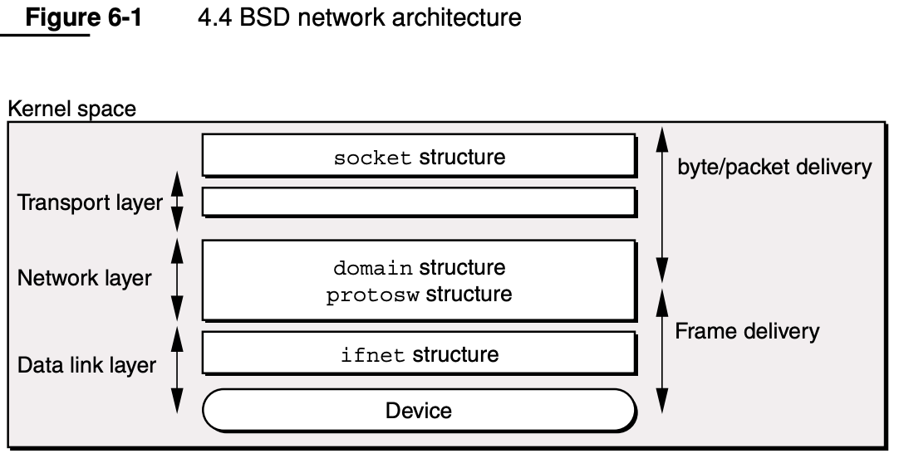
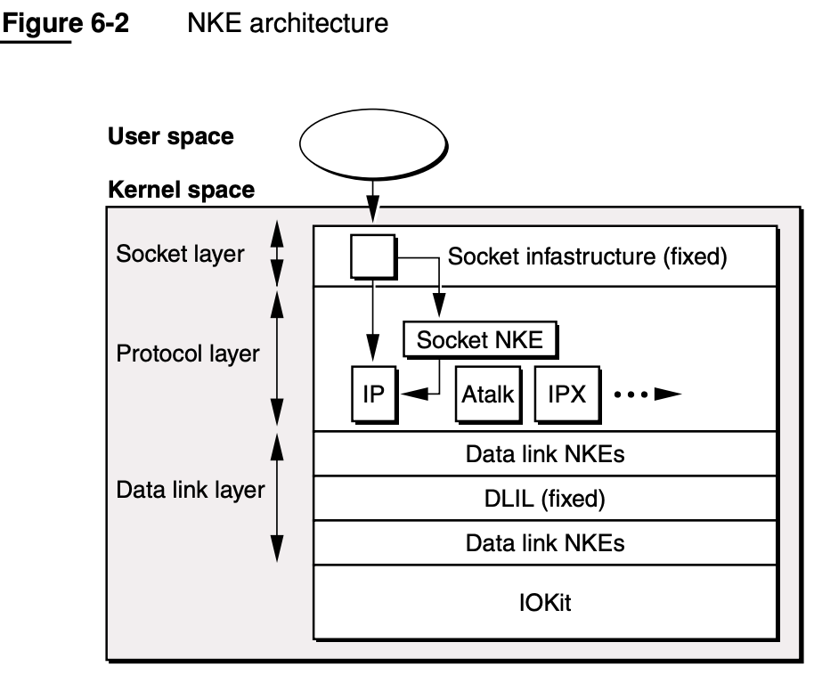
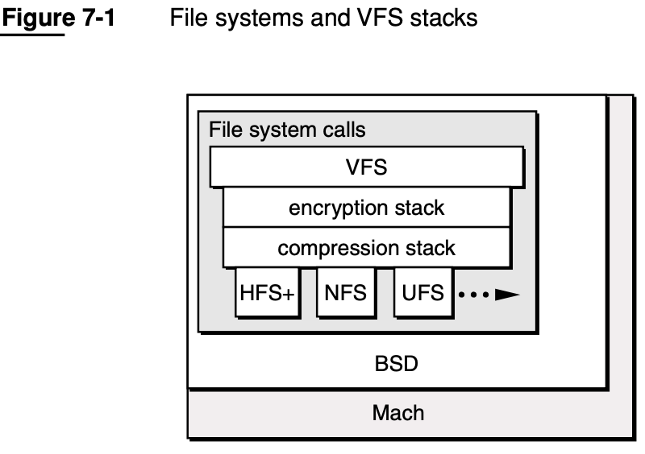

# BSD

* `BSD`=`Berkeley Software Distribution`=`伯克利软件包`
  * logo
    * 
  * 是什么：一个操作系统（内核）
    * 是一个派生自`Unix`的操作系统
  * 类型：`宏内核`=`Monolithic Kernel`
  * 版本
    * 早期
      * `BSD v4.3`
    * 后来
      * `FreeBSD`
        * 基于：`BSD v4.4`
  * 特点
    * 优点
      * 用户服务和内核服务都运行在同一内存空间
        * 这还有效降低了内核态/用户态之间的频繁切换，执行效率会更高
    * 缺点
      * 扩展性较差
      * 如果内核有一个服务崩溃，整个操作系统就会崩溃
  * 此处：在`Darwin`的内核`XNU`中的：`BSD`宏内核
    * 作用：作为完善 Mach 的一个存在，它建立在 Mach 之上，并提供了一层更可靠更现代的 API
    * 包括
      * 任务调度
        * UNIX 进程模型
        * POSIX 线程模型
          * `POSIX Thread Support`=`BSD Thread Model`=BSD线程模型=`pthreads`
        * `IPC`
      * UNIX 用户和组
      * `Networing`=网络=网络协议栈
        * `BSD Socket API`=`BSD Sockets`
        * `NKE`=`Network Kernel Extension`=网络内核扩展
      * `Virtual FileSystem`=虚拟文件系统
      * 其他细节
        * `Security`=`UNIX Security model`
        * `BSD Libraries`=`FreeBSD kernel APIs`
        * `many POSIX APIs`
        * `syscall support`
  * 架构
    * BSD网络架构
      * 
    * `NKE`架构
      * 
    * File systems and VFS stack
      * 
