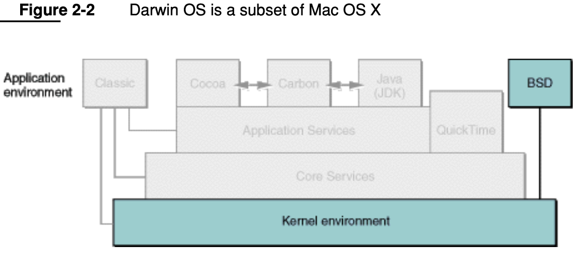
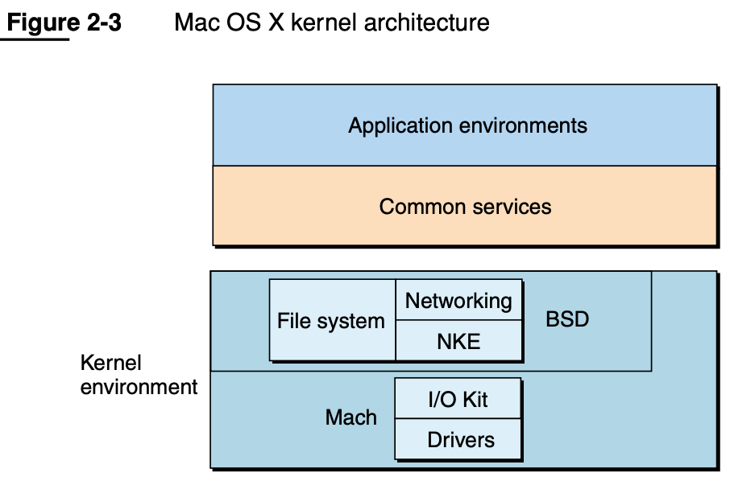
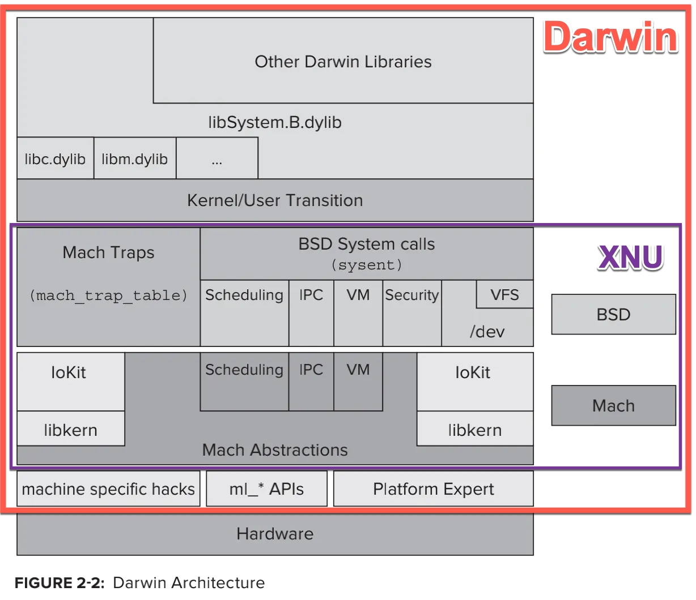
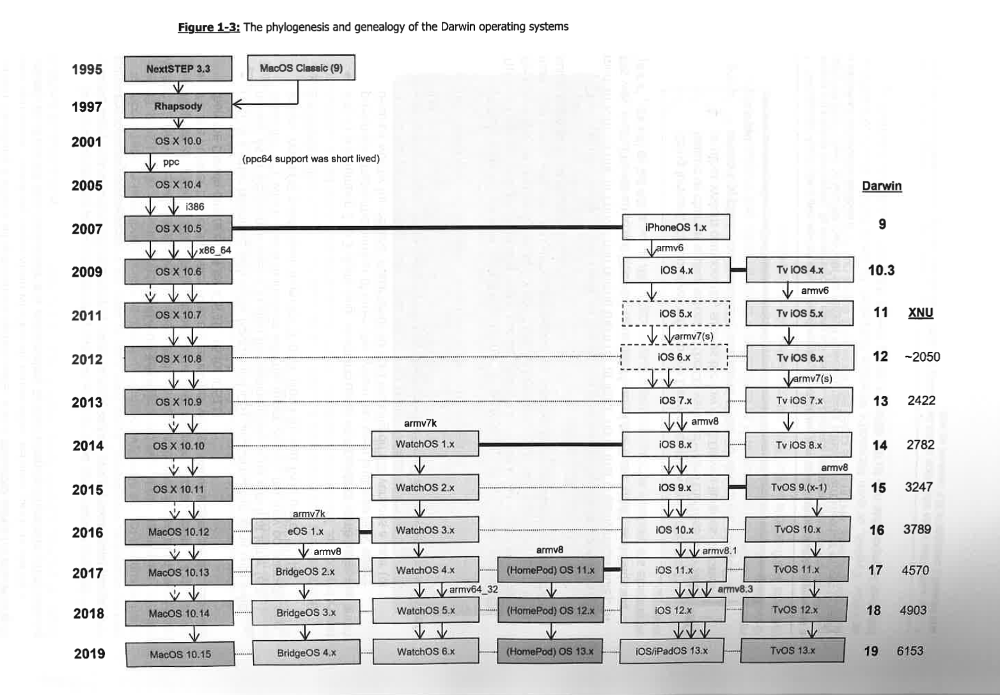

# Darwin

* `Darwin`
  * logo
    * 
  * 概述：各种Apple设备的操作系统的内核
    * 而`Darwin`的内核是[XNU](../../ios_internal_logic/apple_os_part/xnu.md)
      * `Darwin` = `kernel` + `XNU` + `运行时`
  * Darwin架构
    * 早期
      * `OS X`的架构
        * 
    * `OS X`的内核 + 其他部分 => `Darwin`
      * `Darwin and OS X`的架构
        * 
      * (Mac) `OS X`的内核 == `Darwin` 的架构
        * 
    * 最新
      * Darwin架构细节
        * 
  * 组成
    * `XNU`
      * 微内核：`Mach`
      * 宏内核：`BSD`
        * `FreeBSD`
      * `IOKit`
    * 其他
  * 特点
    * 兼容`POSIX`
  * Darwin发展历史
    * 文字
      * `Darwin 0–8`: 对应着`Mac OS X`
      * `Darwin 9`：引入支持`iPhone OS`
      * `Darwin 10-11`：`iPhone OS`改名为`iOS`
      * `Darwin 12–15`：`Mac OS X`改名为`OS X`
      * `Darwin 16–19`：`OS X`改名为`macOS`
      * `Darwin 20+`：最新的各个版本
    * 图
      * 
  