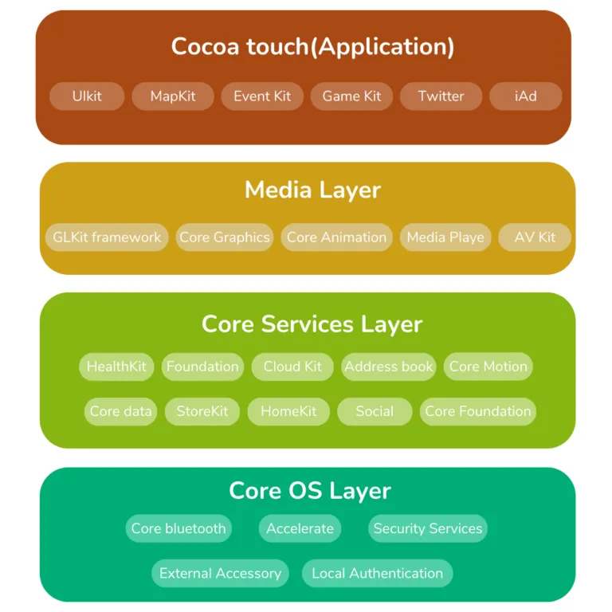

# iOS

* `iOS`
  * 操作系统名称演化历史
    * `iPhone OS`
    * `iOS`
  * 架构
    * 
      * Core OS
      * Core Services
      * Media
      * Coca Touch
  * 一个iOS的小故事
    * iOS1.x 版本最初的代号是 Alpine，这是 i 系列设备的默认 root 密码。
    * 但最后发布的版本代号是 Heavenly，因为这个版本的操作系统拥有完整的调试符号、未加密还容易反汇编，很多越狱者都依赖从这个版本中提取的符号和函数调用关系寻找破解灵感，从越狱者角度来看确实如天堂般美好
  * 关系
    * `iOS`是`iPadO`S、`tvOS`、`watchOS`的基础
