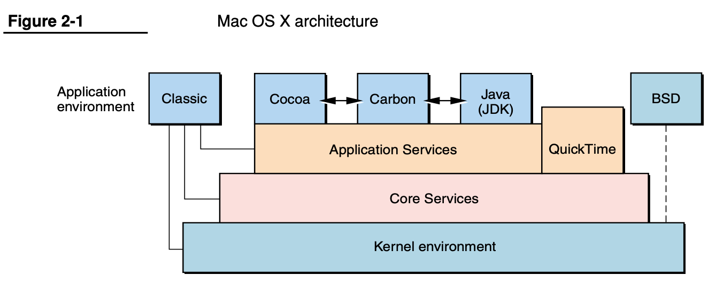
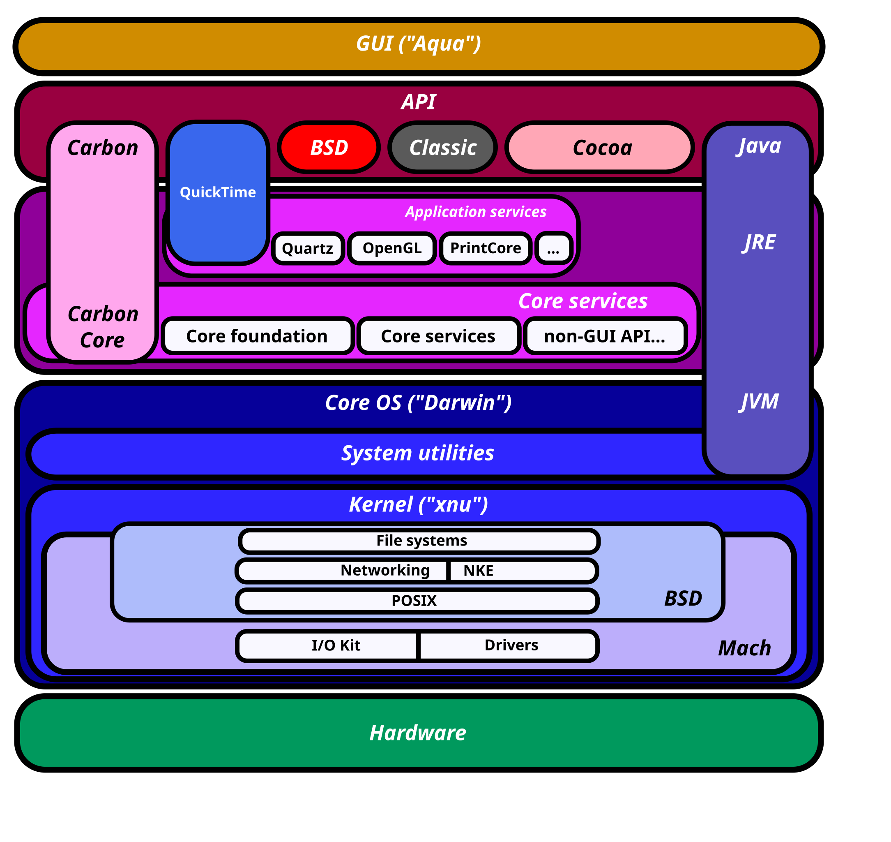

# macOS

* macOS
  * 背景
    * `NeXT`
      * 苹果早期，其创始人乔布斯离开苹果，创办了：`NeXT`
      * `NeXT`公司生产`NeXT`计算机和`NeXTstation`
        * 它们运行在叫做`NeXTSTEP`的操作系统之上
    * `NeXTSTEP`
      * 核心组件
        * `Cocoa`
        * `Mach`
        * `IOKit`
        * （`Xcode`的）`Interface Builder`
      * 特性
        * 采用`Mach`微内核
        * 使用`Objective-C`作为开发语言
        * 面向对象思想贯穿整个操作系统
        * 设备驱动开发是一个面向对象的框架，叫做`DriverKit`
  * 操作系统名称演化历史
    * 概述
      * `Mac OS Classic` -> `Mac OS X` -> `OS X` -> `macOS`
    * 详解
      * `Mac OS Classic`
        * 诞生于苹果，拥有伟大的 GUI 却是一个相对粗糙且很不成熟的操作系统
      * `Mac OS X`
        * 背景
          * `Mac OS Classic`：一个拥有伟大的 GUI 但设计糟糕
          * `NeXTSTEP`：一个设计很棒但 GUI 平淡
        * 融合：`Mac OS Classic` + `NeXTSTEP` => `Mac OS X`
        * 结果：有了`Mac OS Classic`的GUI以及`NextStep`的架构
      * `OS X`
        * `OS X`的架构
          * 
      * `macOS`
    * 表格

| 时间段 | MacOS名称 | 说明 |
| ----- | -------- | ---- |
| 创建 ~ 2001 年 | MachOS Classic	| 古典 MacOS |
| 2001年 ~ 2011 年 | Mach OS X | NeXTSTEP 与 MacOS Classic 合并之后的版本 |
| 2012 年 ~ 2015 年 | OS X | 这是最后一个以猫科动物命名的 OS 版本，此后开始以加州地标命名 |
| 2016 年至今 | macOS | 便于与iOS、tvOS、watchOS 命名统一 |
  * 架构
    * `macOS`架构
      * 图
        * 
      * 文字
        * 闭源的
          * `User Experience Layer`=`用户UI层`
            * 包括`Aqua`、`Dashboard`、`Spotlight`以及一些特性
              * 在iOS中，用户体验完全取决于SpringBoard，同时，iOS中Spotlight也是支持的
              * 即：
                * 对应关系：`macOS`中的`Aqua` ~= `iOS`中的`SpringBoard`
                  * 针对的操作
                    * `macOS`中的`Aqua`：鼠标
                    * `iOS`中的`SpringBoard`：触屏
          * `Application Frameworks layer`=`应用框架层`
            * 包括`Cocoa`、`Carbon`以及`Java`
              * 然而在`iOS`中，只有`Cocoa`（严格来讲，`Cocoa Touch`是`Cocoa`的派生物）
          * `Core Frameworks`=`核心框架层` == `图形和媒体层`=`Graphic and Media layer`
            * 包括`核心框架`、`Open GL`以及`Quick Time`
        * 开源的
          * `Darwin`=`系统核心层`
            * 操作系统核心`kernel`以及`UNIX shell`的环境
            * 详见：
              * [Darwin](../../../ios_internal_logic/apple_os_part/darwin/README.md)

## macOS中查看Darwin版本

* 举例：
  * `macOS v13.6.2`的`Mac M2 Max`中
    * uname相关输出是：
      ```bash
      ➜  ~ uname -v
      Darwin Kernel Version 22.6.0: Thu Nov  2 07:43:25 PDT 2023; root:xnu-8796.141.3.701.17~6/RELEASE_ARM64_T6020
      ```
      * 和：
      ```bash
      ➜  ~ uname -r
      22.6.0
      ```
    * 由此得知：
      * `Darwin`内核的版本是：`22.6.0`
    * 以及相关信息：
      ```bash
      ➜  ~ sw_vers
      ProductName:    macOS
      ProductVersion: 13.6.2
      BuildVersion:   22G320
      ```
