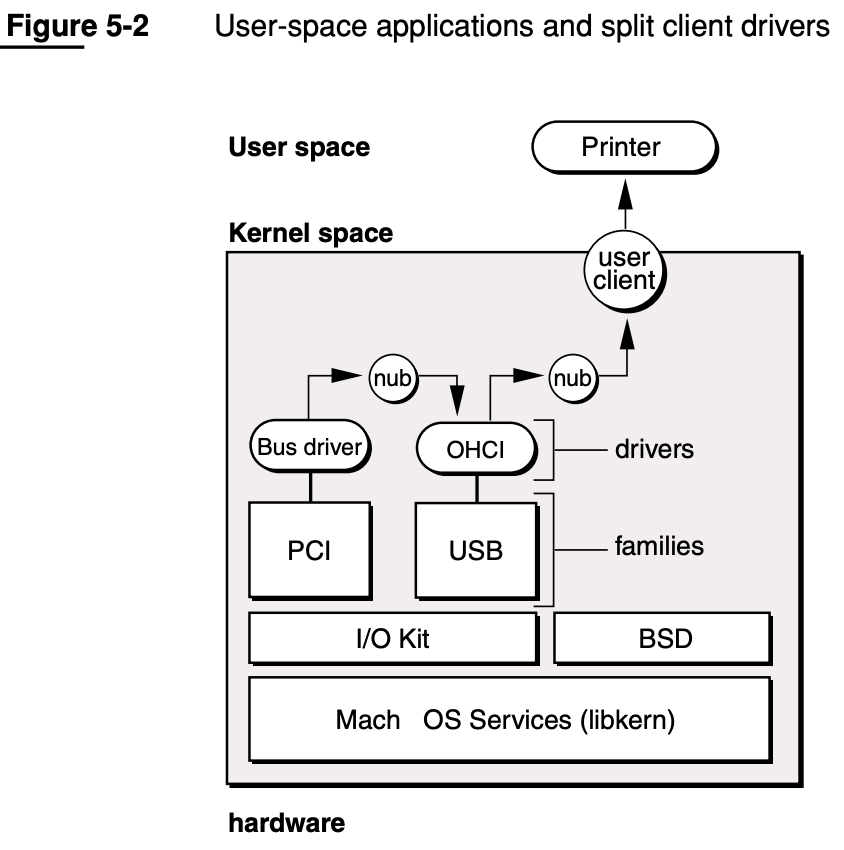

# IOKit

* `IOKit`=`IoKit`=`IO Kit`=`I/O Kit`
  * 发展历史
    * 早期
      * `DriverKit`
        * 语言：`Objective-C`
    * 现在：`IOKit`
        * 语言：`Embedded C++` 
          * `C++`子集
  * 是什么：设备驱动框架
    * 一个实现的面向对象的设备驱动API
      * 凭借`libkern`提供的底层支持，驱动程序可以使用`C++`实现。借助于`C++`的面向对象特性，外部在创建驱动程序时会节省很多成本。
  * 特点
    * 多线程
    * SMP安全
    * 支持热拔插
    * 自动动态设备配置
  * 包括=组成
    * 真正的即插即用
    * 动态设备管理
    * 动态（“按需”）加载驱动程序
    * 桌面系统以及便携式电源管理
    * 多处理器功能
  * 架构
    * I/O Architecture: Families, Drivers, and Nubs
      * 
    * User-space applications and split client drivers
      * 
  * 核心概念
    * [Families](https://developer.apple.com/library/archive/documentation/Darwin/Conceptual/KernelProgramming/IOKit/IOKit.html#//apple_ref/doc/uid/TP30000905-CH213-TPXREF102)
    * [Drivers](https://developer.apple.com/library/archive/documentation/Darwin/Conceptual/KernelProgramming/IOKit/IOKit.html#//apple_ref/doc/uid/TP30000905-CH213-BEHDCDDC)
    * [Nubs](https://developer.apple.com/library/archive/documentation/Darwin/Conceptual/KernelProgramming/IOKit/IOKit.html#//apple_ref/doc/uid/TP30000905-CH213-TPXREF103)
