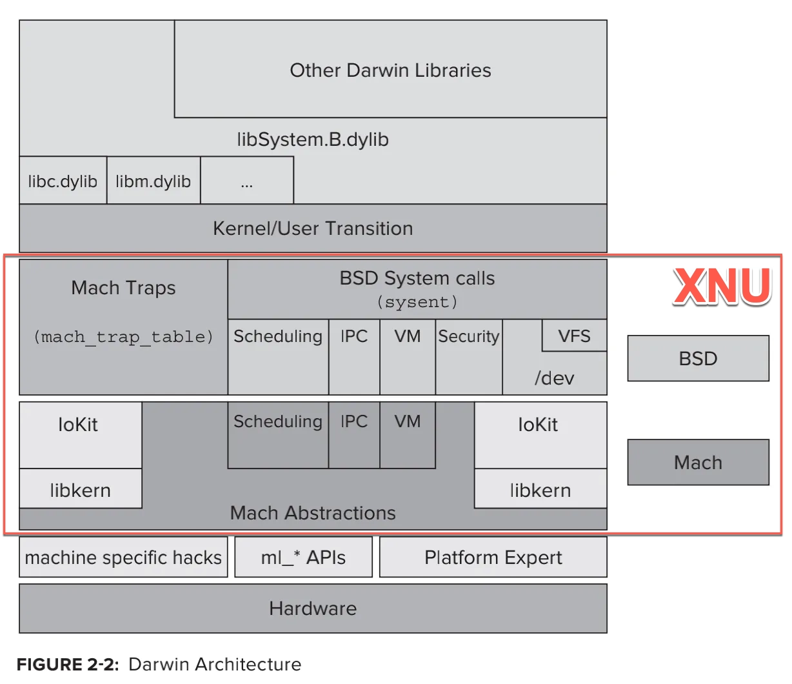
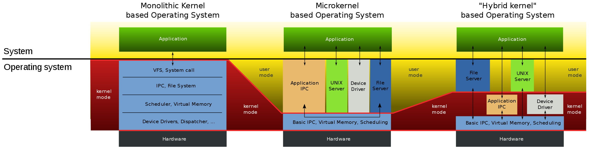

# XNU

* `XNU`= **X** is **N**ot **U**nix
  * 相关名词
    * `POSIX`=`Portable Operating System Interface`
    * `SMP`=`Symmetric MultiProcessing`
  * 是什么：
    * 一个混合内核（操作系统）
      * 解释：`Mach`是微内核（Microkernel） + `BSD` 是宏内核（Monolithic Kernel） = `XNU`是一个混合架构（Hybrid kernel）
    * 是（苹果的操作系统的核心）[Darwin](../../ios_internal_logic/apple_os_part/darwin/README.md)的核心部分
  * 概述
    * 英文
      * XNU kernel is part of the Darwin operating system for use in macOS and iOS operating systems. 
    * 中文
      * XNU是：iOS（和tvOS、watchOS）的（操作系统）内核
      * XNU也是Darwin的一部分
        * Darwin是MacOS的操作系统内核
  * 目标
    * 实现既有微内核(Microkernel)的灵活性，又有宏内核(Monolithic Kernel)的良好性能
      * 微内核(Microkernel)指的是：`Mach`
        * 功能定义比较清晰 ~= 提高操作系统模块化程度
          * 内存管理 ~= 内存保护
          * 进程间（和处理器间）通信（IPC） ~= 消息传递的机制
          * 其他低级操作系统功能
        * 在操作系统和底层硬件之间，提供了一个有用的隔离层
      * 宏内核(Monolithic Kernel)指的是：`BSD`
        * 宏内核在高负荷下表现出高性能
        * BSD是一个精心设计的、成熟的操作系统，具有许多功能，和提供了一组行业标准API
          * 文件管理 ~= 文件系统
          * 设备访问
          * POSIX线程模型 == `pthread`
          * 网络
          * 等
        * 事实上，当今大多数商业UNIX和类UNIX操作系统都包含大量的BSD代码
  * 架构
    * Darwin的核心是XNU
      * 
    * XNU架构内部关系
      * 
    * XNU架构细节
      * 
  * 包括=组成
    * 概述
      * `XNU` = `Mach` + `BSD` + `libkern` + `IOKit`
        * 最初的：`XNU`=`Mach v2.5` + `BSD v4.3`
        * 后续的：`XNU`=`OSFMK v7.3` + `FreeBSD`
    * 详解
      * 微内核：`Mach`
        * 作用
          * 早期用于（`OS X Server`中的）`Apple`的`MkLinux`项目
        * 包含内容
          * `IPC`
          * `Memory`
          * `Parallel Execution`
          * `Real-Time Support`
          * `Console I/O`
          * `Security`
      * 宏内核：`BSD`
        * 包含内容
          * 进程和线程
            * `POSIX Thread Support`=`BSD Thread Model`=BSD线程模型=`pthreads`
            * `IPC`
          * 文件系统
            * `Virtual FileSystem`=虚拟文件系统
          * 网络
            * `Networing`= 网络协议栈
          * 其他
      * `IOKit`=`I/O Kit`=`IO Kit`
        * 设备驱动框架
          * 一个实现的面向对象的设备驱动API
          * 凭借`libkern`提供的底层支持，驱动程序可以使用`C++`实现。借助于`C++`的面向对象特性，外部在创建驱动程序时会节省很多成本。
      * `libkern`
        * 一个内建的 C++ 库
          * 用于支持 C++ 运行时
          * 有了它内核的很多高级功能都可以使用 C++ 编写
  * 支持的CPU架构
    * x86_64
    * ARM
    * IA32
  * 相关
    * 微内核（Microkernel） vs 宏内核（Monolithic Kernel） vs 混合架构（Hybrid kernel）
      * 说明：理解这几种内核的关键是需要注意内核模式和用户模式占据的范围
      * 对比
        * 

## XNU源码

* XNU源码
  * 旧：opensource.apple.com
    * 离线下载
      * https://opensource.apple.com/tarballs/xnu/
    * 在线浏览
      * https://opensource.apple.com/source/xnu/
  * 新：github.com
    * 旧
      * https://github.com/apple/darwin-xnu
    * 新
      * https://github.com/apple-oss-distributions/xnu
        * 源码下载
          * https://github.com/apple-oss-distributions/xnu/archive/refs/tags/
            * xnu-11215.1.10
              * https://github.com/apple-oss-distributions/xnu/archive/refs/tags/xnu-11215.1.10.zip
              * https://github.com/apple-oss-distributions/xnu/archive/refs/tags/xnu-11215.1.10.tar.gz
  * 其他
    * 在线浏览`xnu`代码
      * [XXR - XNU cross reference - Alpha (newosxbook.com)](http://newosxbook.com/xxr/index.jl)
        * 
* XNU代码核心部分=代码树
  * config - configurations for exported apis for supported architecture and platform
  * SETUP - Basic set of tools used for configuring the kernel, versioning and kextsymbol management.
  * EXTERNAL_HEADERS - Headers sourced from other projects to avoid dependency cycles when building. These headers should be regularly synced when source is updated.
  * libkern - C++ IOKit library code for handling of drivers and kexts.
  * libsa - kernel bootstrap code for startup
  * libsyscall - syscall library interface for userspace programs
  * libkdd - source for user library for parsing kernel data like kernel chunked data.
  * makedefs - top level rules and defines for kernel build.
  * osfmk - Mach kernel based subsystems
  * pexpert - Platform specific code like interrupt handling, atomics etc.
  * security - Mandatory Access Check policy interfaces and related implementation.
  * bsd - BSD subsystems code
  * tools - A set of utilities for testing, debugging and profiling kernel.

## xnu版本

### Mac

* Mac
  * uname -a
    * `Darwin crifandeMacBook-Pro.local 20.6.0 Darwin Kernel Version 20.6.0: Mon Aug 30 06:12:21 PDT 2021; root:xnu-7195.141.6~3/RELEASE_X86_64 x86_64`
  * sysctl
    * kern.version
      * `Darwin Kernel Version 20.6.0: Mon Aug 30 06:12:21 PDT 2021; root:xnu-7195.141.6~3/RELEASE_X86_64`

### iPhone6

* Mac
  * uname -a
    * `Darwin Crifan-iPhone6 18.7.0 Darwin Kernel Version 18.7.0: Mon Aug 19 22:24:08 PDT 2019; root:xnu-4903.272.1~1/RELEASE_ARM64_T7000 iPhone7,2 arm64 N61AP Darwin`
  * sysctl
    * kern.version
      * `Darwin Kernel Version 18.7.0: Mon Aug 19 22:24:08 PDT 2019; root:xnu-4903.272.1~1/RELEASE_ARM64_T7000`

### iPhone7

对于自己的越狱手机，此处的iPhone7，去查看对应的xnu的版本：

```bash
➜  ~ ssh root@192.168.0.33
iPhone7:~ root# uname -a
Darwin iPhone7 19.6.0 Darwin Kernel Version 19.6.0: Sat Jun 27 04:35:37 PDT 2020; root:xnu-6153.142.1~4/RELEASE_ARM64_T8010 iPhone9,1 arm64 D10AP Darwin
```

此处被测的已越狱的iPhone的xnu是：

`xnu-6153.142.1`

去官网找对应版本的代码：

[xnu Source Browser (apple.com)](https://opensource.apple.com/tarballs/xnu/)

没看到这个版本

-》只能找到，最接近的版本：

* xnu-6153.141.1.tar.gz
  * https://opensource.apple.com/tarballs/xnu/xnu-6153.141.1.tar.gz

可下载下来，供后续参考研究。

### iPhone8, iOS 15.1

iOS 15.1，iPhone8的信息：

```bash
iPhone8-150:~ root# uname -a
Darwin iPhone8-150 21.0.0 Darwin Kernel Version 21.0.0: Sun Aug 15 20:55:55 PDT 2021; root:xnu-8019.12.5~1/RELEASE_ARM64_T8015 iPhone10,1 arm Darwin
```

中，就有：

* `xnu-8019.12.5~1/RELEASE_ARM64_T8015 `

其中xnu就是：iOS的内核

版本是：`8019.12.5`

## xnu相关内容

### 用unc0ver给iPhone7越狱的日志中

```bash
Kernel Version: Darwin Kernel Version 19.6.0: Sat Jun 27 04:35:37 PDT 2020; root:xnu-6153.142.1~4/RELEASE_ARM64_T8010
```

### 用checkra1n给iPhone6越狱的日志中

```bash
set xnu boot arg cmdline to : [rootdev=md0]
```
