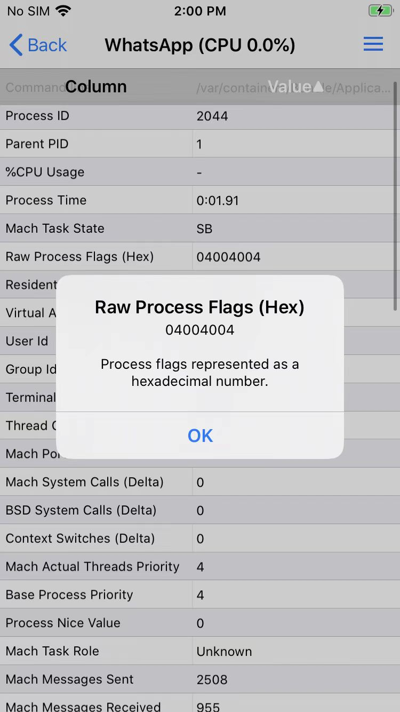
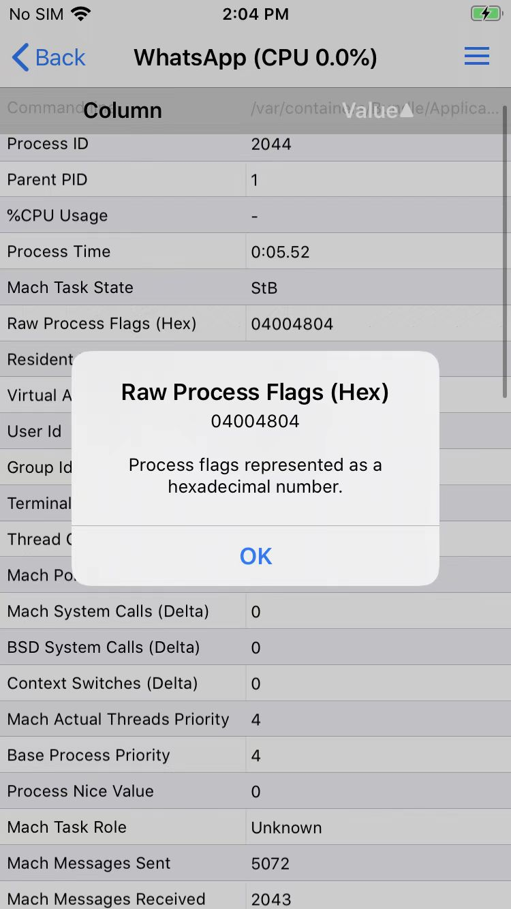

# 进程flag应用场景举例

## akd

iOS中（通过工具：`CocoaTop64`）查看出akd进程的：

* `flag`=`0x4004004`
  * 含义是
    * `CS_PLATFORM_BINARY` = 1
      * `#define CS_PLATFORM_BINARY     0x4000000       /* this is a platform binary */`
    * `CS_ENTITLEMENTS_VALIDATED` = 1
      * `#define CS_ENTITLEMENTS_VALIDATED      0x0004000       /* code signature permits restricted entitlements */`
    * `CS_GET_TASK_ALLOW` = 1
      * `#define CS_GET_TASK_ALLOW      0x0000004       /* has get-task-allow entitlement */`

## WhatsApp

用CocoaTop查看WhatsApp进程的flag属性：

* 含义解释
  * `0x4000000` -> `CS_PLATFORM_BINARY`=1
  * `0x0004000` -> `CS_ENTITLEMENTS_VALIDATED`=1
  * `0x0000004` -> `CS_GET_TASK_ALLOW`=1

以及，给改进程去调试后：

* Frida调试：flag没变
* Xcode调试：flag变了
  * 变成了
    * 
      * 新增了：`CS_RESTRICT`=`0x0000800`
